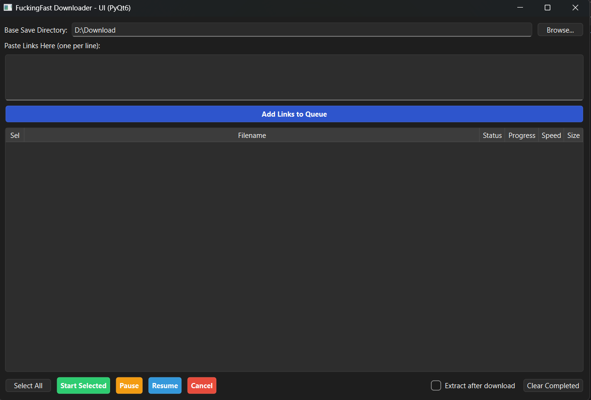
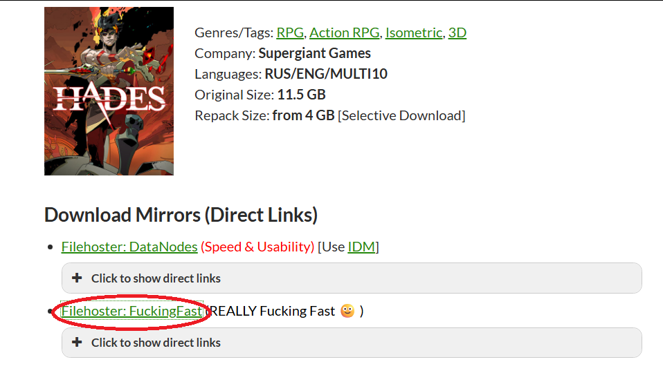
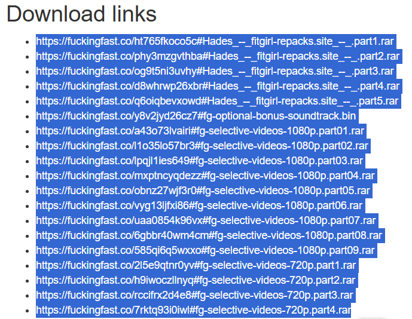
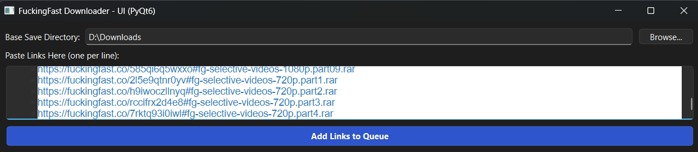
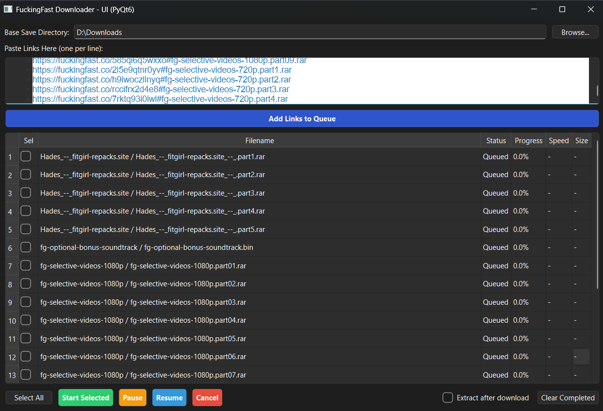

# SilverSpoon (previously FitGirlDownloader)

> **Note:** Currently, this tool ONLY supports `fuckingfast.co` links (often used by FitGirl Repacks). Support for other hosts may be added in the future.

A Python-based bulk downloader designed to bypass Cloudflare protections on file-hosting sites like *fuckingfast.co*. It automates the process of extracting direct download links and supports concurrent downloading with pause and resume capabilities.

## Features

* **Cloudflare Bypass:** Uses `cloudscraper` to mimic a real browser and bypass anti-bot challenges.
* **Persistent Download History:** Automatically saves your task queue, progress, and folder groupings across sessions. Close the app anytime without losing your place!
* **Grouped Batch Folders:** Downloads are neatly organized into collapsible dropdown trees, showing aggregated progress, speed, and ETA for entire batches.
* **Smart Folder Grouping & Batching:** Automatically suggests a unified folder name for a batch of links, perfectly grouping main game parts and messy optional files together.
* **Persistent Settings:** Your preferences (save directory, concurrent workers, extraction options) are saved and remembered for your next session.
* **Import Links & Clipboard:** Easily load bulk link lists from `.txt` files directly via the File menu, or use the "Paste from Clipboard" button for styled-free pasting.
* **Live Speed & ETAs:** Features a real-time global download speed tracker and Calculates Estimated Time Remaining (ETA) for both individual files and total batch completions.
* **Customizable UI:** Interactive, resizable columns that save their state so your layout is always exactly how you left it.
* **File Management:** Safely delete tasks and optionally remove their associated physical files from your disk using the trash button or keyboard shortcuts.
* **Direct Link Extraction:** Automatically simulates the internal HTMX POST requests required to fetch the real `.rar` direct links.
* **Multi-threading:** Downloads multiple parts concurrently (default 3 workers, customizable in Settings) to maximize bandwidth.
* **Pause, Resume & Retry:** Safely pause your downloads, recover from network drops, or quickly retry errored links using HTTP `Range` headers.
* **Graphical Interface:** Includes a clean, modern GUI built with PyQt6.
* **Command Line Interface:** Also includes a lightweight CLI script for server environments or automation.

## Requirements

* Python 3.10+
* Dependencies listed in `requirements.txt`

## Installation

1. Clone this repository:
   ```bash
   git clone https://github.com/billysams21/SilverSpoon.git
   cd SilverSpoon
   ```
2. Install the required Python packages (or do it inside virtual environment):
   ```bash
   pip install -r requirements.txt
   ```

## Usage

### Using the GUI (Recommended)
Launch the graphical interface (or double-click `SilverSpoon.exe`):
```bash
python pyqt_downloader.py
```



1. Click **Browse...** to select your base save directory (or set a persistent default in `File -> Settings`).
2. Open the game link and click the provider you want to use (for now it's FuckingFast).

3. Copy the links you want to download.

4. Paste your `fuckingfast.co` links into the top text box (one per line) or use `File -> Import Links from File...`.

5. Click **Add Links to Queue**. A prompt will appear allowing you to confirm the Batch Folder name so all main and optional files go to the exact same place.
6. Click **Select All** (or check individual boxes) for the files you want to download.
7. (Optional) Check the **Extract after download** checkbox if you want files extracted automatically using the built-in 7-Zip engine.
8. Click the green **Start / Resume** button to begin downloading.

9. Use the **Pause** and **Start / Resume** buttons to manage your selected downloads at any time.

### Using the CLI
If you prefer the command line:
1. Put your links into `link.txt` (one per line).
2. Run the script:
   ```bash
   python downloader.py link.txt
   ```
*(Files will be downloaded to the current working directory).*

## Contributing

We welcome contributions! If you'd like to help improve SilverSpoon, please see our [Contributing Guide](CONTRIBUTING.md) for instructions on how to set up your environment, follow our branching strategy (`dev` branch), and submit Pull Requests.

## Changelog

Detailed release notes and history of changes can be found in the [CHANGELOG.md](CHANGELOG.md) file.

## Disclaimer

This tool is provided for educational and automation purposes only. The author is not responsible for the content downloaded using this tool. Please respect the terms of service of the file-hosting providers.
